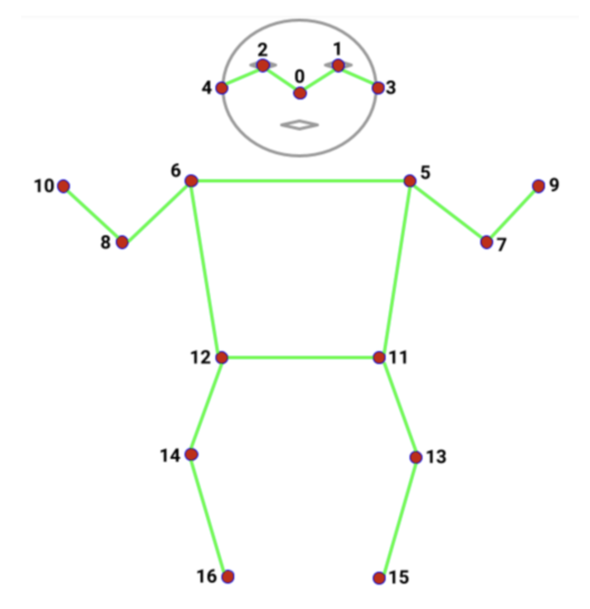

# **Post Flappy Bird Game**

## **Desciption**
It's a `React` + `Tensorflow.js` frontend web-game project. `Tesnsorflow.js` is a powerful and convenient deep learning libary. I use Movenet in [tfjs-models](https://github.com/tensorflow/tfjs-models) to do single human body **pose detection**.
MoveNet is an ultra fast and accurate model that detects 17 keypoints of a body.  



<br/>

I use the shoulder key points and wrist key points to controll the flappy bird. Try to mimic bird flying and flap you arm, you will see the bird flying up ! 
Furthermore, this game will use you web-cam to detect your pose. But don't worry, even though you don't have web-cam you still can use mouse to play the game. Please follow the instruction and enjoy the game !
 

## **Install**
1. clone this repo
2. Install frontend package  
   yarn:
   ``` shell
   cd post-flappy-bird 
   yarn
   ```

   npm:
   ``` shell
   cd post-flappy-bird 
   npm install
   ```

## **Run in localhost**
yarn: 
```shell
yarn start
```

npm:
```shell
npm start
```

## **Reference**
- [tfjs-models: Pose Detection](https://github.com/tensorflow/tfjs-models/tree/master/pose-detection)
- [flappy-bird](https://github.com/Lucifier129/flappy-bird)
- [Flappy Pose](https://github.com/MIDIBlocks/handsfree-flappy-bird)

